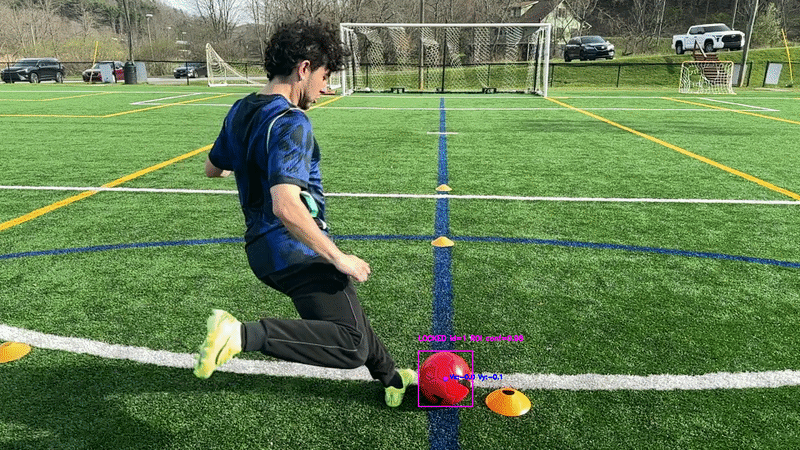
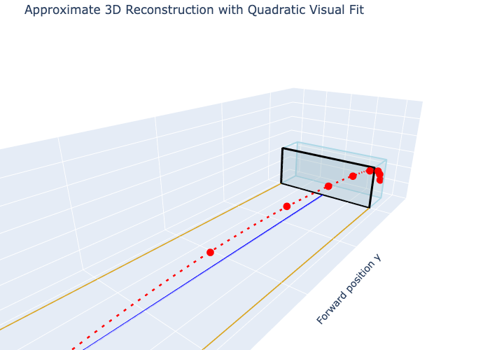

# Computer Vision Freekick System

A computer vision and physics based pipeline for reconstructing an approximate soccer ball trajectory from freekick video.

This project was built as a Computer Science / Physics capstone connecting object detection, tracking, camera geometry, projectile motion, and uncertainty analysis in a real world sports setting.

---

## Project Overview

The system tracks a soccer ball through video frames and exports frame level trajectory data for later analysis. The current pipeline uses YOLO based ball detection, region of interest tracking, relock logic after missed detections, CSV logging, and visual overlays.

The longterm goal is a low cost sports analytics system that can reconstruct ball motion from smartphone camera footage and provide feedback on shooting form.

The current version is a working pipeline focused on detection, tracking, relock behavior, logging, and annotated output. The next major step is adding a front end where a user can drop in a video, run the pipeline, and receive the processed output without manually changing paths inside the script.

---

## Current Status

This repository currently shows the working backend pipeline.

The next planned development steps are:

* Build a front end for video upload / drag and drop input
* Add user facing controls for running the pipeline
* Add edge case detection for videos where no ball is visible
* Add edge case detection for videos where no freekick is taking place
* Add clearer output handling for failed or invalid inputs
* Add visual examples showing the tracking pipeline working

---

## Key Features

* YOLO based soccer ball detection
* Region of interest tracking for continuity
* Global re-search / relock logic after missed detections
* HOLD frame logic for temporary occlusion or detection failure
* Kalman style smoothed ball state tracking
* Per frame CSV logging of raw position, smoothed position, velocity, confidence, and bounding box size
* Annotated output video with tracking status overlays
* Early SIFT based spin/RPM experimentation

---

## Tech Stack

* Python
* OpenCV
* NumPy
* Ultralytics YOLO
* Jupyter Notebook

---

## Repository Structure

```text
artifacts/          Generated overlays, logs, plots, and output files
configs/            Configuration files and calibration values
data/               Input data folders and annotations
docs/               Project documentation and visual assets
models/             Local model directory; model weights are not tracked
notebooks/          Jupyter notebooks for experiments and demos
scripts/            Runnable scripts for pipeline execution and testing
src/                Core source modules
tests/              Test files
```

---

## Pipeline Summary

1. Load input video.
2. Detect candidate soccer balls using a YOLO model.
3. Initialize a locked ball track during the acquisition phase.
4. Track the ball using expected motion and ROI-based candidate filtering.
5. Use HOLD frames when the detector temporarily loses the ball.
6. Trigger global re-search if the ball remains lost.
7. Re-lock onto the best global candidate when detection recovers.
8. Write accepted frames to CSV.
9. Export annotated tracking video.

---

## Example Output



This GIF shows the current backend pipeline tracking the ball from the behind goal camera view and displaying frame level tracking status overlays.



This static plot shows the current approximate 3D reconstruction from synchronized left-view and behind-view event points.

The repository also includes a 3D reconstruction demo notebook:

```text

notebooks/cvfs_demo.ipynb

```

The notebook uses sample synchronized event points from the left and behind camera views to generate an approximate 3D ball trajectory.

Planned additions:

* Sample CSV output explanation
* Pipeline diagram

---

## Running the Pipeline

Clone the repository:

```bash

git clone https://github.com/nathanspereira/Computer-Vision-Freekick-System.git

cd Computer-Vision-Freekick-System

```

Create a virtual environment:

```bash

python3 -m venv .venv

source .venv/bin/activate

```

Install dependencies: 

```bash

pip install -r requirements.txt

```

Run the current pipeline:

```bash

python scripts/run_pipeline.py

```

Note: the current script expects local raw video files and YOLO model weights that are not tracked in GitHub because of file-size constraints.

## Data and Model Weight Notes

Raw videos, processed videos, and YOLO model weights are intentionally excluded from version control.

Ignored examples include:

* data/raw/
* data/processed/
* artifacts/overlays/
* artifacts/logs/
* *.mp4
* *.mov
* *.pt

This keeps the repository lightweight while preserving the code needed to run and review the system.

---

## Current Limitations

* The current pipeline is still partly monolithic inside scripts/run_pipeline.py.
* Full stereo triangulation is not yet implemented.
* Calibration is still approximate and based on known field/goal geometry.
* Lateral position estimates are expected to have higher uncertainty than frame level 2D tracking.
* Raw video inputs and model weights are not included in the repository.
* The current version requires manually setting input and output paths inside the script.
* The front end upload flow is not yet implemented.
* Edge case handling for no ball detected or no freekick detected is still planned.
* MVP depends on red ball, as YOLO fails with low contrast (White ball against white net background)

---

## Next Improvements

* Add a front end for video upload / drag and drop input
* Add a simple user workflow for selecting a video and running the pipeline
* Add edge case detection for invalid videos, no ball detected, and no freekick taking place
* Refactor scripts/run_pipeline.py into smaller modules under src/
* Add command line arguments for input/output paths
* Add lightweight tests for tracking and CSV logging behavior

---

## Author

Nathan Pereira  
Computer Science and Physics  
Appalachian State University  
